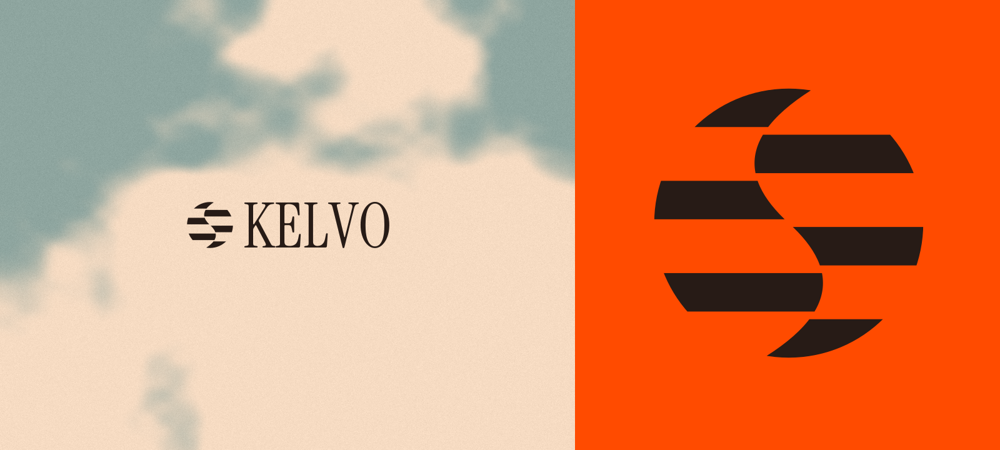

<p align="center">
  
</p>

<p align="center">
  <a href="#quick-start">Quick start</a> · <a href="#try-it-in-a-notebook">Notebooks</a> · <a href="#use-kelvo-behind-your-api">Integrate</a> · <a href="#documentation">Docs</a> · <a href="#how-kelvo-fits">Architecture</a> · <a href="#real-analytics-measured">Benchmarks</a>
</p>

# Kelvo

**Query your databases. Get Arrow results.**

Kelvo is an open-source Go analytics gateway by [SYNEHQ](https://synehq.com). Query databases directly, join supported sources with DuckDB, or reuse Parquet snapshots. Send typed Arrow results to notebooks, dashboards, agents and APIs.

[Use Kelvo behind your API](#use-kelvo-behind-your-api) to execute saved-connection queries, supported writes and background jobs. Your application keeps authentication, authorization and credential decryption.

**Developer preview.** Check [source coverage](docs/source-coverage.md), [validation](docs/validation.md) and [delivery status](docs/production-roadmap.md#delivery-status) before choosing a deployment.

## Quick start

1. Install Go 1.26+ and a C/C++ toolchain. Linux amd64 is the initial validation target.
2. Build Kelvo and query the included CSV:

```sh
git clone https://github.com/SYNEHQ/kelvo-go.git
cd kelvo-go
go build -tags duckdb_arrow -o bin/kelvo ./cmd/kelvo

bin/kelvo query --config examples/kelvo.yml --sources sales \
  --sql 'SELECT region, SUM(amount::DECIMAL(18,2)) AS revenue FROM sales GROUP BY region ORDER BY region' \
  --out revenue.arrow
```

3. Open the result with [PyArrow](docs/usage.md#quick-start), or [serve the HTTP API](docs/usage.md#http-api).

## Try it in a notebook

The [15 Colab and Jupyter lessons](notebooks/README.md) include public data, setup, answer checks and cleanup. No database account or GPU is needed for the default examples.

| Start with                     | Open in Colab                                                                                                                  |
| ------------------------------ | ------------------------------------------------------------------------------------------------------------------------------ |
| First query: Palmer Penguins   | [Lesson 01](https://colab.research.google.com/github/SYNEHQ/kelvo-go/blob/cargo/notebooks/01-first-query.ipynb)                |
| Analytical SQL: NYC Taxi trips | [Lesson 03](https://colab.research.google.com/github/SYNEHQ/kelvo-go/blob/cargo/notebooks/03-taxi-parquet-exploration.ipynb)   |
| Authenticated HTTP API         | [Lesson 15](https://colab.research.google.com/github/SYNEHQ/kelvo-go/blob/cargo/notebooks/15-authenticated-http-gateway.ipynb) |

## How Kelvo fits

[](brand/kelvo-architecture.svg)

Analytics overview. One query runs on one worker. Add workers to run more independent queries. [Architecture](docs/architecture.md) · [Security model](SECURITY.md)

## Use Kelvo behind your API

For one explorer installation, [application mode](docs/application-mode.md) uses local SQLite state for PostgreSQL and MySQL operations. It keeps credential resolution and contained execution without NATS.

Any application can use the [HTTP API](docs/usage.md#http-api) with configured sources. In cluster mode, your own authorization and credential resolver can also supply saved connections on demand, without individual entries in Kelvo YAML.

1. Your API authenticates the caller, authorizes the saved connection and signs the request.
2. The assigned worker resolves current credentials over private mTLS when execution starts.
3. Kelvo executes the query or supported operation and returns results and receipts to your API.

Credentials stay out of query payloads and NATS. Contained Go/JDBC adapters support reads, writes, metadata and selected migration, ingestion and watcher jobs. Capabilities differ by engine; reconcile uncertain writes before retrying.

Use the [public Go SDK](docs/application-sdk.md) and [independent application example](examples/application/) to connect your own authentication and credential store. The SDK handles request signing, HTTPS, Arrow validation and private resolver callbacks. [On-demand trust](docs/on-demand-connections.md) · [Database operations](docs/database-operations.md) · [Validation](docs/database-operations-validation.md)

On-demand analytical queries do not yet support acceleration or durable exports.

## Execution and sources

| Path                              | Sources                                                                                                                                           |
| --------------------------------- | ------------------------------------------------------------------------------------------------------------------------------------------------- |
| DuckDB attachments                | CSV, Parquet, DuckDB, SQLite, PostgreSQL, MySQL                                                                                                   |
| Optional native federation bridge | ClickHouse, PostgreSQL, MySQL, SQL Server, Oracle, Snowflake, BigQuery, Databricks, [Flight SQL](docs/federation-flight-sql.md)                   |
| Native queries                    | The federation sources above, MongoDB, D1, Trino/Presto, Elasticsearch, Exasol, Spanner, Ignite 2, Athena, DynamoDB, Cosmos DB                    |
| External query services           | Separately operated [Flight SQL or legacy `dbapi` HTTP services](docs/sources-adapters.md)                                                        |
| Contained operation adapters      | Saved-connection reads, supported writes, metadata and jobs through [Go adapters](adapters/go/README.md) or [JDBC runtimes](docs/jdbc-runtime.md) |

Use the [coverage matrix](docs/source-coverage.md) for exact modes, types and validation. Native connector support does not imply federation support. Live sources have no shared transaction snapshot.

## Dataset acceleration

Refresh selected data into immutable Parquet snapshots, then query it without reading the source again:

```sh
bin/kelvo accelerate refresh --config examples/acceleration.yml --dataset sales_fast
bin/kelvo query --config examples/acceleration.yml --sources sales_fast \
  --sql 'SELECT region, SUM(amount) FROM sales_fast GROUP BY region' --out revenue.arrow
```

Use [local storage](docs/acceleration.md) or opt into [S3, R2, GCS or Azure Blob](docs/object-storage.md). Refreshes are full extracts; incremental snapshot refresh and result caching are not available yet. Supported source watchers do not automatically update these snapshots.

## Security and cluster operation

`serve` has one trust domain. Shared deployments need tenant-bound worker pools, separate NATS accounts, mTLS and host/container isolation. Use read-only grants for analytics; writes require separate signed operation authority and source permissions.

Configure [admission, source quotas and drain](docs/operations.md), then validate your workload. DuckDB completes execution before Arrow delivery; output limits and compression do not cap process memory. [Deploy workers](deploy/README.md) · [Cluster lifecycle](docs/cluster.md)

[Durable exports](docs/exports.md) keep complete Arrow results on worker storage for repeat downloads. They use separate admission and recheck principal access on every request. Enable them explicitly; worker storage is not automatically replicated.

## Real analytics, measured

Four workflows query **22,612,607 NYC Taxi trips** with CTEs, joins and windows. All **84 measured runs** passed exact-result checks, after 28 preflights.

Median seconds over three sequential trials, including startup and Arrow file persistence. Local Azure runs use identical Parquet, two execution threads, a 1536 MiB service cap and LZ4 output.

| Workflow                   | Kelvo / DuckDB | DuckDB / Python | Polars / Python |
| -------------------------- | -------------: | --------------: | --------------: |
| Daily KPIs + 7-day windows |          0.484 |           0.634 |           0.636 |
| Hourly borough hotspots    |          1.035 |           1.052 |           1.464 |
| Route joins + distance mix |          1.497 |           1.816 |           1.064 |
| Monthly zone momentum      |          0.606 |           0.691 |           0.749 |

Kelvo and Python use DuckDB 1.5.6; Polars uses 1.44.2. Startup and binding overhead affect these command timings. They do not show Kelvo accelerating DuckDB itself.

With live ClickHouse on Azure, native queries compute at the source; federation transfers rows for local DuckDB execution:

| Workflow                   | Azure native | Oracle native | Azure federation | Oracle federation |
| -------------------------- | -----------: | ------------: | ---------------: | ----------------: |
| Daily KPIs + 7-day windows |        0.627 |         1.480 |            1.508 |            33.490 |
| Hourly borough hotspots    |        2.171 |         3.727 |            4.096 |            42.922 |
| Route joins + distance mix |        1.822 |         2.358 |            3.180 |            62.275 |
| Monthly zone momentum      |        0.911 |         1.630 |            1.861 |            40.274 |

Oracle used a burstable Always Free E2.1.Micro (951 MiB RAM, 1/8 OCPU entitlement) and SSH forwarding. All 24 Oracle trials fit a 640 MiB service cap; sampled peak process RSS was 379.3 MiB. Source and tunnel memory were outside the cap. Azure's federated hotspot query hit its 640 MiB cap and spilled.

[Full report, raw trials and reproduction](docs/analytics-workflow-benchmarks.md)

## Evidence and limits

- **Local native export:** 1.18–1.48 million returned rows/s for one 10-million-row ClickHouse workload, including file persistence. [Scope](docs/validation.md)
- **Oracle micro VM:** 30/30 native LZ4 exports, ten at a time, returned 120 million verified rows at 443,000 aggregate rows/s. The source ran on Azure; transport used SSH tunnels. Ten concurrent federated sorts exhausted the same memory cap. [Report](docs/oracle-micro-capacity.md)
- **Latest pinned worker-only trial (`b1a0ea5`):** Five metrics on/off pairs and 130 exact workload queries through one execution slot, plus a separate three-query preflight. Gateway, NATS, source and SSH memory are excluded. [Results and scope](docs/node-capacity.md)

These are measurements of recorded binaries and workloads, not throughput guarantees. Result caching, incremental snapshot refresh, a Flight SQL server and production HA certification remain open work.

## Documentation

| Task                                     | Guide                                                                                                                               |
| ---------------------------------------- | ----------------------------------------------------------------------------------------------------------------------------------- |
| Query or integrate                       | [CLI/API](docs/usage.md) · [Go SDK](docs/application-sdk.md) · [Application example](examples/application/)                         |
| Connect saved customer databases         | [On-demand queries](docs/on-demand-connections.md) · [Database operations](docs/database-operations.md)                             |
| Run one explorer installation            | [Application mode](docs/application-mode.md) · [Configuration](examples/application.yml)                                            |
| Run supported writes and jobs            | [Go adapters](adapters/go/README.md) · [JDBC runtimes](docs/jdbc-runtime.md) · [Validation](docs/database-operations-validation.md) |
| Join sources or add a federation adapter | [Federation](docs/federation.md) · [Adapter SDK](docs/federation-adapters.md)                                                       |
| Refresh and recover datasets             | [Acceleration](docs/acceleration.md) · [Backups](docs/snapshot-backup.md)                                                           |
| Deploy and troubleshoot                  | [Deployment](deploy/README.md) · [Operations](docs/operations.md)                                                                   |
| Tune batching and inspect overhead       | [Throughput tuning](docs/throughput-tuning.md)                                                                                      |
| Find a specific guide                    | [Documentation index](docs/README.md)                                                                                               |

## Build with us

Start with [CONTRIBUTING.md](CONTRIBUTING.md) and the [delivery board](https://github.com/orgs/SyneHQ/projects/3). Connector fixes, exact-type handling, reproducible benchmarks and clearer docs are welcome.

```sh
go test -tags duckdb_arrow ./...
go vet -tags duckdb_arrow ./...
```

[Apache-2.0](LICENSE) · [Third-party notices](NOTICE) · [Brand assets](brand/README.md) · Built by [SYNEHQ](https://synehq.com)
