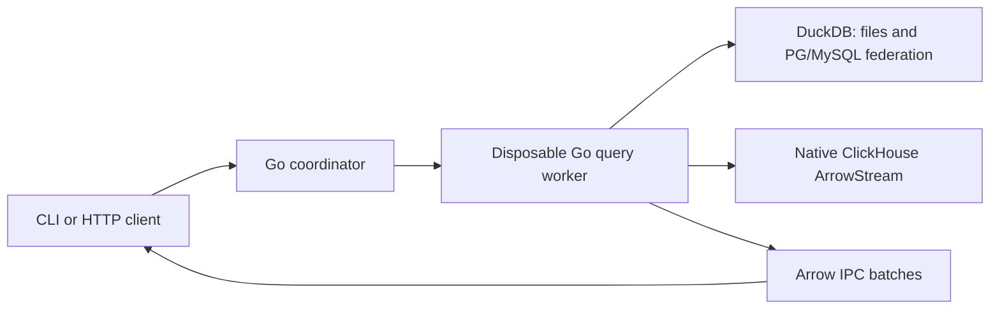

# Architecture

Kelvo Go owns source registration, query lifecycle, Arrow delivery and admission.
DuckDB supplies SQL execution and federation. Native ClickHouse executes at the source.
No DataFusion, Drill, LLM/GPU runtime, Kubernetes operator or Hakopod dependency is included.

Each query uses a new process and a fresh DuckDB instance. Only selected source definitions and their explicitly named environment variables enter the worker. Cancellation and deadlines terminate a child while its parent remains alive; deployment supervision must also bound the entire worker process tree when the gateway itself is forcibly terminated. Neither mechanism creates a filesystem or network sandbox. Deployment tools supply those boundaries. A process failure terminates its query; streams are not transparently resumed.

The callback contract is `Executor.Execute(context, Request, Sink)`. A sink borrows each Arrow batch only during its synchronous Write call. The DuckDB adapter keeps execution, record iteration and Release inside the leased `sql.Conn.Raw` callback.

The pinned DuckDB Go v2.10506.0 path uses non-streaming pending execution, then exposes batches. Kelvo bounds returned rows before execution and enforces delivery limits, but native allocations can precede a limit check. First-batch latency and working memory depend on the engine plan. For a native ClickHouse request, the same configured memory limit is passed to ClickHouse as its per-query memory budget and bounds Kelvo's local Arrow decoding allocator; it is still not a worker-process RSS cap.

HTTP handles have a bounded TTL registry and one result consumer. Authentication currently uses one service token for the configured trust domain. Multi-tenant identity/KMS integration, Arrow Flight SQL, durable exports, materialized generations, CDC and additional native adapters are future acceptance milestones, not present features.

Live federation reads sources independently. It has no global transaction or comparable cross-source watermark. Later CDC must include snapshot/log handoff, durable checkpoints, idempotent replay, deletes, schema changes and recovery from expired source history.

Source references:

- [DuckDB Go Arrow API](https://github.com/duckdb/duckdb-go/blob/v2.10506.0/arrow.go)
- [Driver query execution](https://github.com/duckdb/duckdb-go/blob/v2.10506.0/statement.go#L778-L803)
- [DuckDB streaming flag](https://github.com/duckdb/duckdb/blob/v1.5.6/src/main/capi/pending-c.cpp#L17-L44)
- [Arrow IPC](https://arrow.apache.org/docs/format/Columnar.html#serialization-and-interprocess-communication-ipc)
- [Spice OSS](https://github.com/spiceai/spiceai), architectural reference
