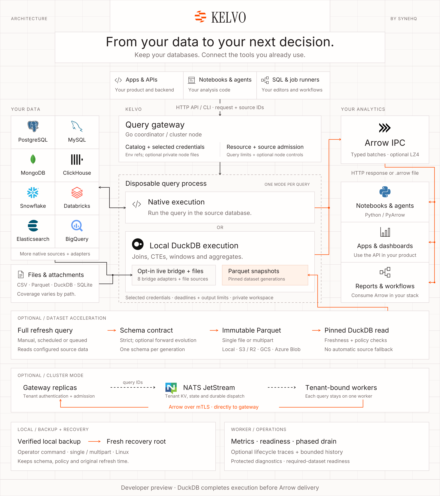

# Architecture

Kelvo Go by SYNEHQ owns source registration, query admission, execution lifecycle and Arrow delivery. Native mode runs a query at one configured source. Federated mode runs SQL in a local DuckDB instance over supported live inputs, files and optional persistent Parquet snapshots.

## Workflow in text

Read the main diagram from the caller at the top, through the selected execution mode, to Arrow consumers on the right. The lower rows describe optional dataset and cluster lifecycles, plus operator controls.

1. **Submit a request.** The caller supplies SQL or a supported native request, parameters and registered source IDs. The CLI has no bearer-token layer. HTTP `serve` uses one service token for its configured catalog; the cluster gateway maps each bearer token to a provisioned tenant. Requests cannot supply arbitrary connection credentials or override the cluster tenant. Optional [live gateway key files](gateway-key-rotation.md) add overlapping rotation and bounded revocation within that same tenant boundary.
2. **Admit and claim execution.** The CLI executes directly. Single-domain `serve` creates a bounded, in-memory TTL handle; its first results request claims a concurrency permit and starts execution. In cluster mode, the gateway reserves a tenant job slot in JetStream KV and queues only its query ID. A tenant-bound node reserves local capacity before pulling a job, claims ownership atomically, and waits for the gateway's single-consumer result claim before execution. Optional node resource budgets and tenant-wide source quotas add admission controls. Status and cancellation use the query handle.
3. **Resolve selected inputs.** The coordinator applies configured limits and a deadline, selects registered sources, and pins requested accelerated generations after checking their policy and freshness. The trusted parent resolves only selected source credential references. By default these names resolve from its environment; a cluster node can map them to private files, with bounded caching for new query and refresh processes. Catalogs and child input retain reference names; secret values enter only the selected child's environment, and provider file paths stay in the parent. Dataset-only queries receive no original-source credentials.
4. **Choose one execution mode.** Native mode invokes the connector for one configured connection, using the source's query language and capabilities. Federated mode creates a fresh in-memory DuckDB instance for joins, CTEs, windows and aggregates. It reads supported files and attachments; the optional live Arrow scan bridge has eight built-in adapters: ClickHouse, PostgreSQL, MySQL, SQL Server, Oracle, Snowflake, BigQuery and Databricks. Accelerated aliases resolve to pinned Parquet generations in this same DuckDB mode. Native connector availability does not imply live federation; see the [capability matrix](source-coverage.md#acceleration-and-federation-capabilities).
5. **Deliver typed results.** The engine writes borrowed Arrow batches synchronously into an uncompressed local IPC pipe. The parent validates IPC framing, metadata and delivery limits, then applies public result compression once: uncompressed by default, optionally `lz4_frame`. The CLI finalizes and atomically publishes an Arrow file. HTTP returns `application/vnd.apache.arrow.stream` for PyArrow or another compatible consumer. Cluster result bytes travel directly from the node to the gateway over mTLS, then to the caller. HTTP retrieval is single-consumer; callers must check transport completion and terminal status.

## Execution and admission boundaries

Each query uses a new process. Native queries invoke their selected connector directly; federated queries create a fresh local DuckDB instance. Only selected source definitions and resolved credential values enter the worker. Cluster nodes launch it through a native Landlock/seccomp sandbox before Go creates threads. Tenant containers provide PID, memory and network boundaries. Cancellation terminates the query process group; deployment supervision must also bound the process tree when a node is forcibly terminated. A process failure terminates its query; streams are not transparently resumed.

Optional [node resource admission](operations.md) shares a reservation pool between queries and refreshes, accounting for configured engine memory, overhead, scratch and refresh staging. Operators can reserve capacity for interactive queries. These are reservations, not RSS or filesystem quota enforcement; separate node processes do not share this accounting. Container limits and measured host budgets remain necessary.

Optional [source quotas](operations.md#shared-source-quotas) limit admitted operations against selected registered sources across a tenant's nodes. One operation may open multiple scans, so a quota is not a database connection limit. Dataset-only reads do not reserve slots for their original sources. Source identities still need dedicated read-only grants and source-side workload limits. [Private credential files](operations.md#file-based-source-credential-rotation) rotate values for new processes; they do not change existing queries or rotate parent object-storage, NATS, gateway or TLS credentials.

The callback contract is `Executor.Execute(context, Request, Sink)`. A sink borrows each Arrow batch only during its synchronous `Write` call. The DuckDB adapter keeps execution, record iteration and `Release` inside the leased `sql.Conn.Raw` callback.

The pinned DuckDB Go v2.10506.0 path completes non-streaming pending execution before exposing batches. Arrow delivery does not make execution streaming or bound all native query memory. Kelvo bounds returned rows before execution and enforces delivery limits, but native allocations can precede a limit check. First-batch latency and working memory depend on the engine plan. For native ClickHouse requests, the configured memory limit is passed to ClickHouse as its per-query memory budget and bounds Kelvo's local Arrow decoding allocator; it is not a worker-process RSS cap.

The [optional federation bridge](federation.md) receives DuckDB optimizer projections and typed filters, executes supported predicates through Go native connectors, and lends retained/pinned Arrow batches back through the C Data interface. Integer and boolean filters can be pushed to the source; string, decimal, floating-point and temporal filters stay in DuckDB. Joins and aggregates execute in local DuckDB. Trusted contributors can add an adapter through the [public Go interface](federation-adapters.md). The bridge retains the subprocess boundary and uses an opt-in pinned driver accessor patch.

Live federation reads sources independently. It has no global transaction or comparable cross-source watermark.

## Full refresh to pinned dataset reads

[Dataset acceleration](acceleration.md) is a persistent dataset lifecycle. It feeds the same local DuckDB execution mode shown above.

1. **Extract a full result.** A trusted catalog defines the refresh query and limits. Refreshes can run manually, through a local scheduler, or through a bounded tenant NATS refresh queue. Every refresh reruns the configured source query and consumes source resources; it is not incremental loading or CDC.
2. **Check the schema contract.** Cross-generation schema matching is strict by default. Operators can permit selected [forward schema evolution](schema-evolution.md), such as appended nullable columns or supported type widening. Every batch and part within one generation must still match one exact Arrow schema. An incompatible or failed refresh leaves the prior generation intact.
3. **Publish a complete immutable generation.** The default local backend writes one Parquet file and atomically publishes its manifest. Optional [multipart acceleration](multipart-acceleration.md) writes a bounded ordered set of files; readers pin the whole generation. The [object backend](object-storage.md) supports S3, R2, Google Cloud Storage and Azure Blob with conditional publication and immutable objects. Existing readers keep their pinned generation when a replacement is published.
4. **Acquire by policy and freshness.** A query pins only its selected dataset generations after checking their catalog/authorization fingerprint and age. Missing, stale or incompatible snapshots fail acquisition without automatic source fallback. Age is measured from completed refresh, not a source commit watermark. Dataset-only queries receive no original-source credentials.

For local storage, query processes receive only selected immutable Parquet inputs. For object storage, a parent-owned loopback range bridge serves only selected versions and rejects upstream redirects. Cloud reader and writer credentials remain in the parent. It neither pre-downloads whole snapshots nor maintains a persistent local cache.

Each node handles at most one refresh at a time, separately from query slots. When node resource budgets are configured, refresh publication and queries share that reservation pool. The separate refresh queue carries dataset identifiers and configuration fingerprints, never source SQL, credentials or Arrow data. Refresh failure categories, retry suppression and explicit operator reset are covered in [operations](operations.md#source-refresh-failures-and-recovery).

Copied data does not inherit later database revocations automatically: operators must change `authorization_version` when grants or permitted data change and publish a valid replacement. Independent datasets have no global transactional snapshot. Acceleration is a developer preview; persistent snapshots are neither a query-result cache nor an automatic guarantee of lower source cost.

## Cluster control and result paths

[Cluster mode](cluster.md) uses tenant tokens, NATS account isolation, atomic KV admission and worker leases. The job record in tenant KV contains the request, including SQL and parameters; the dispatch queue carries only the query ID. Credentials and Arrow result batches do not enter NATS. NATS carries lifecycle and cancellation state, while the mTLS connection carries the Arrow result.

One query executes on one worker. More workers serve other independent queries; no SQL plan or intermediate shuffle is distributed between nodes. After execution the node records `result_ready`. The gateway verifies that state and ownership, commits `succeeded`, and only then releases the final Arrow end-of-stream marker. Failed or partial streams do not carry successful completion. Worker loss or client disconnect ends the attempt; there is no transparent stream replay or automatic execution retry.

Single-domain `serve` remains one trust domain. Tenant-wide source grants do not provide automatic per-user row policies. External identity/KMS integration, an Arrow Flight SQL server (the project includes a Flight SQL client), durable query exports and CDC remain future work.

## Verified local backup and recovery

On Linux, the operator-only [snapshot backup command](snapshot-backup.md) copies one current local single-file or multipart generation into a new private acceleration root. It verifies Parquet bytes, row counts and Arrow schema before publication, preserving the generation, authorization fingerprint, checksums and original refresh time. It needs no source query or database secrets.

Recovery copies from that backup into another fresh root. The operator verifies it, inspects status, tests the intended query, and then explicitly switches service configuration and mounts. The command never overwrites an existing destination or switches a running service. Verification establishes integrity, not freshness: stale data remains stale. Backup scheduling, replication and failover remain operator responsibilities, and object-storage backup is not supported by this command.

Retained-generation `accelerate restore` is a separate operation within an existing store. Local and remote restore require matching policy, exact schema and verified generations; it is not a replacement for a separate backup when the current payload is corrupt. See [remote generation recovery](operations.md#remote-generation-inventory-and-restore).

## Worker operations

[Worker diagnostics](operations.md#diagnostics) provide fixed-cardinality Prometheus metrics and aggregate resource state through protected mTLS endpoints. Optional bounded execution history stays in memory and disappears on restart. Optional [lifecycle tracing](tracing.md) exports sampled local query/refresh spans through OTLP/HTTP; it does not establish distributed trace continuity or full stage timing. Metrics, history and traces exclude SQL, parameters and secret values.

Gateway liveness and readiness bypass ordinary HTTP request permits. Worker readiness can additionally require selected datasets to have usable, fresh metadata under the current catalog. It does not verify payload integrity, source health or spare execution capacity. Explicit verification and recovery checks remain separate.

Gateway and node shutdown use phased drain: stop admission, fail readiness, retain result/status/cancel operations during a grace period, then cancel remaining work and shut down. Assigned queries are never automatically replayed. Configuration and limits are in the [maintenance guide](operations.md#maintenance).

## Source references

- [DuckDB Go Arrow API](https://github.com/duckdb/duckdb-go/blob/v2.10506.0/arrow.go)
- [Driver query execution](https://github.com/duckdb/duckdb-go/blob/v2.10506.0/statement.go#L778-L803)
- [DuckDB streaming flag](https://github.com/duckdb/duckdb/blob/v1.5.6/src/main/capi/pending-c.cpp#L17-L44)
- [Arrow IPC](https://arrow.apache.org/docs/format/Columnar.html#serialization-and-interprocess-communication-ipc)
- [Parquet format](https://parquet.apache.org/docs/file-format/)
