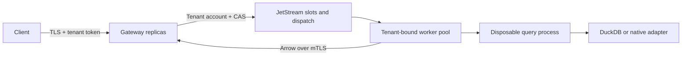

# Cluster mode

NATS JetStream dispatches query IDs; tenant KV holds SQL and parameters. Workers send Arrow over mTLS to gateways, which relay it to authenticated clients. Credentials and result batches never enter broker messages.



Each query runs on one worker. More nodes handle independent queries; they do not split a SQL plan or share a DuckDB file. Static tenant policies partition slots, concurrency, sources and secrets.

## Durable lifecycle

1. A fixed KV slot stores admission and complete query state atomically. Reusing a terminal slot creates a new ID and invalidates its previous handle, even before TTL.
2. A worker reserves local capacity, binds its worker ID and boot-owner token with CAS, then acknowledges dispatch. Duplicate messages cannot create another assignment.
3. A gateway claims results once with a nonce checked by the worker. Shared state permits status, cancellation and initial retrieval through any gateway.
4. Workers renew identity/job leases. Renewal failure cancels execution; capacity releases after executor cleanup. Reusing a worker ID requires expiry of its previous lease.

```text
queued -> assigned -> claimed -> running -> result_ready -> succeeded
                     \           \-----> failed/cancelled
                      \----------------> failed/cancelled
```

Assigned work is never silently replayed. Worker loss or delivery failure ends the attempt; explicit resubmission may see changed data. This is not exactly-once database execution. Require read-only source grants.

## Results and errors

| Operation | Endpoint |
| --- | --- |
| Submit | `POST /v1/queries` |
| Status | `GET /v1/queries/{id}` |
| Single-consumer results | `GET /v1/queries/{id}/results` |
| Cancel | `POST /v1/queries/{id}/cancel` |

Every operation authenticates a tenant token; headers cannot override its tenant. Optional [principal keys](principal-access.md) also restrict sources and handle ownership. [Callback row/column policies](row-column-access.md) filter registered tables before SQL operations. Limits fail explicitly instead of returning successful truncation.

Queued result requests wait until assignment, job expiry or client disconnect without claiming the handle. Two separate pools each allow `max_http_requests`: active requests and parked result waiters. Assigned waiters reacquire an active permit before claiming. HTTP 429 occurs before claim consumption; back off and retry the same handle. The pools prevent waiter starvation of active operations, but promise no scheduling fairness.

To accept a cluster result:

1. Require the recognized `Kelvo-Result-Completion: durable-eos-v1` capability.
2. Consume complete HTTP framing and exactly one valid Arrow stream.
3. Verify the final eight-byte Arrow EOS. The gateway releases it only after the worker records `result_ready` and the gateway durably commits `succeeded`.

The header alone, a partial body or status 404 never proves success. After certified delivery, 404 can mean slot reuse. Without the recognized capability, require successful terminal status as well as complete transport/Arrow delivery; reject unknown capability versions. Standalone HTTP does not advertise this guarantee. Status success alone cannot prove client receipt.

`/health` reports liveness. Gateway `/ready` requires every tenant's broker reconciliation; worker readiness requires the sandbox probe and identity claim. Supervision should restart a node that loses its lease. See [admission and maintenance](operations.md).

## Operations and security

1. Provision with separate `cluster-init` credentials. Gateways/nodes validate existing resources; policy changes require drain and reprovisioning.
2. Enforce the [container and OS boundaries](../deploy/README.md). Internal TLS requires CA, hostname and SPIFFE verification: `spiffe://kelvo/gateway` and `spiffe://kelvo/tenant/<tenant>/worker/<worker>`. Endpoints are operator-configured; redirects and environment proxies are disabled.
3. Choose broker failure domains, disk limits, encryption, monitoring and tested backups. Synchronize clocks for application-timestamp leases. Three local brokers do not establish multi-zone durability.
4. Use optional [gateway key rotation](gateway-key-rotation.md) for overlapping service keys and per-replica revocation.
5. Share [accelerated snapshots](acceleration.md) through tenant POSIX storage or the [object backend](object-storage.md). Refresh dispatch is separate; object staging stays node-local. Snapshots do not make query handles replayable.

Policies remain static; changes require the drained account cutover described in [principal access](principal-access.md). There is no tenant-enrollment API, durable query-result catalog or single-query distribution. Optional [local audit](durable-audit.md) records protected operations and fails closed when durable recording is uncertain. Retain tenant container limits. The pinned DuckDB Go path materializes execution before Arrow delivery. Landlock ABI 3 or newer is required; unsupported hosts fail closed. Check [production status](production-status.md) for the accepted containment scope.

## Reproduce acceptance

On a disposable Linux test host with the toolchain and PyArrow installed:

```sh
go build -tags duckdb_arrow -o bin/kelvo ./cmd/kelvo
cc -O2 -Wall -Wextra -Werror sandbox/launcher.c -o bin/kelvo-landlock
python3 scripts/cluster_fixture.py provision
python3 scripts/cluster_fixture.py test-store --go go
python3 scripts/cluster_acceptance.py
python3 scripts/cluster_fixture.py stop
```

Always stop owned fixtures, including on failure. Provisioning downloads checksum-pinned NATS v2.15.0, binds loopback ports and generates private identities under ignored `artifacts/cluster-private`. Container acceptance separately checks network isolation. Keep keys, customer SQL and private paths out of public evidence.

References: [consumers](https://docs.nats.io/nats-concepts/jetstream/consumers), [KV](https://docs.nats.io/nats-concepts/jetstream/key-value-store), [accounts](https://docs.nats.io/running-a-nats-service/configuration/securing_nats/accounts), [NATS release](https://github.com/nats-io/nats-server/releases/tag/v2.15.0), [Landlock](https://docs.kernel.org/userspace-api/landlock.html), [Arrow IPC](https://arrow.apache.org/docs/format/Columnar.html#serialization-and-interprocess-communication-ipc).
