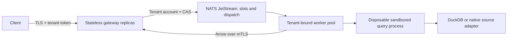

# Cluster mode

Kelvo uses NATS JetStream for durable query dispatch and state. Workers stream Arrow directly to a gateway over mTLS, and the gateway forwards it to the authenticated client. Queue messages contain only a query ID. SQL and parameters are stored in the tenant's KV bucket; database credentials and result batches are excluded.



One worker executes a query. Additional nodes run other independent queries. There is no distributed shuffle, cross-node SQL plan or shared DuckDB file. Tenant A's sources and secrets never enter tenant B's workers. Static operator policy partitions query slots and worker concurrency among tenants; the gateway validates that their sum fits the configured cluster budget.

## Durable lifecycle

Each fixed KV slot contains both admission and complete query state in one compare-and-swap operation. The random ID includes the slot number. Reusing a terminal slot creates a new ID; the previous ID becomes unavailable, even before its original TTL. These are short-lived result handles, not an audit database or durable export catalog.

```text
queued -> assigned -> claimed -> running -> result_ready -> succeeded
                     \           \-----> failed/cancelled
                      \----------------> failed/cancelled
```

The worker reserves a local concurrency permit before pulling a job, then atomically binds its worker ID and boot-owner token before acknowledging the queue message. A duplicate message cannot create another assignment. The gateway claims result retrieval once with a random nonce; the worker checks it before execution. Gateway replicas share this state, so status, cancellation and initial result requests do not require sticky routing.

Assignment is never automatically retried. Worker loss, lease failure or client disconnection ends the attempt. A caller can explicitly submit another query, which may observe different source data. This is not exactly-once database execution: process failure and network ambiguity remain possible. Read-only database grants are required, and no partially delivered query is silently replayed.

Workers renew their identity and job leases. Failure to renew cancels execution. Gateways reconcile queued jobs and expire stale assigned jobs. Replacing a worker ID requires its previous lease to expire. A concurrency permit is released only after its query executor exits, including cancellation cleanup.

## Results and errors

HTTP APIs are `POST /v1/queries`, `GET /v1/queries/{id}`, `GET /v1/queries/{id}/results`, and `POST /v1/queries/{id}/cancel`. Every operation authenticates a tenant token; caller-supplied tenant headers cannot override it. Results are single-consumer. Query limits fail explicitly rather than returning an apparently complete truncation.

An initial result request can wait for assignment until its durable job expires
or the client disconnects. Waiting does not claim the result or fail a valid
queued job after an unrelated fixed timeout. Queued result requests use a separate
bounded waiter pool so they cannot prevent retrieval of already assigned jobs.
`max_http_requests` bounds each pool: the gateway admits at most that many active
requests plus the same number of parked result waiters. Status, cancellation and
assigned-result requests use the active pool. An assigned waiter must reacquire
an active permit before claiming delivery. If either pool is full, the gateway
returns HTTP 429 before consuming the result claim; retry the same handle after
backoff. Cancellation, expiry and shutdown release the held permit. The separate
pools prevent queued waiters from blocking all active requests; they are not a
fairness or throughput guarantee.

The node records `result_ready` after successful execution. The gateway verifies
that state, durably commits `succeeded`, then releases the final eight-byte Arrow
EOS marker. The nonterminal ready state prevents slot reuse during this handoff.
A failed stream is aborted without a successful end marker.

Cluster result responses advertise `Kelvo-Result-Completion: durable-eos-v1`.
This header announces the completion protocol; it is not a success receipt.
A client that recognizes this capability can certify durable success only after
successfully consuming the complete HTTP response, parsing exactly one valid
Arrow stream, and verifying its final eight-byte EOS. The gateway releases that
EOS only after its durable success commit. A header on an incomplete body,
truncated Arrow data, or failed HTTP framing is never success. Reject unknown
capability versions instead of guessing their semantics.

After certified delivery, a separate status request is diagnostic: the bounded
terminal slot can already have been reused and return 404 under concurrent load.
A 404 by itself never proves success. Without the recognized gateway capability,
clients must still check successful terminal status as well as transport and
Arrow completion. The standalone HTTP server does not advertise this guarantee.
The gateway can fail to deliver a result whose execution succeeded; status alone
does not prove receipt by the client.

`/health` reports process liveness. Gateway `/ready` requires successful reconciliation for every configured tenant and recovers after broker service recovers. Worker readiness requires the native sandbox startup probe and worker-identity claim. A node that loses its lease becomes unavailable and should be restarted by deployment supervision.

See [worker admission, metrics and maintenance](operations.md) for optional shared
query/refresh budgets, protected diagnostics and graceful draining.

## Operations and security

Use `cluster-init` with separate provisioner credentials. Running `gateway` and `node` commands bind and validate existing resources; they do not silently alter policies or create missing streams. Policy changes require a deliberate drain and reprovisioning procedure; there is no rolling policy migration API yet. See the [container example](../deploy/README.md) for YAML and mandatory operating-system boundaries.

Certificates require CA trust, hostname verification and URI identities. Gateways present `spiffe://kelvo/gateway`; each worker presents `spiffe://kelvo/tenant/<tenant>/worker/<worker>`. Redirects and environment HTTP proxies are disabled on internal result requests. Endpoints come from operator configuration, never query data.

The NATS example uses three file-backed replicas with per-account storage limits and a bounded pull consumer. Production operators must choose failure domains, disks, encryption, monitoring, backup/restore and broker service limits. A local three-process quorum test does not establish multi-zone HA or production durability. Use synchronized host clocks; lease expiry is evaluated from application timestamps.

Remaining limitations include fixed policies, no tenant CRUD/API token rotation API, no per-user row policies, no durable result storage, no single-query distribution and no per-query cgroup. Container limits bound each tenant node. DuckDB still materializes execution before Arrow delivery with the pinned Go driver. Linux ABI 3 or newer is required; unsupported hosts fail closed.

Optional [dataset acceleration](acceleration.md) uses a separate bounded JetStream refresh queue in each tenant account. Workers share that tenant's immutable Parquet generations through an operator-provided POSIX volume or the opt-in [object backend](object-storage.md). Object refresh staging stays node-local; each node uses the same tenant catalog, object namespace and read identity. Query-result storage remains separate; refreshed dataset snapshots do not make query handles replayable or add single-query distribution.

## Reproduce acceptance

On a disposable Linux test machine with the build toolchain and pyarrow installed:

```sh
go build -tags duckdb_arrow -o bin/kelvo ./cmd/kelvo
cc -O2 -Wall -Wextra -Werror sandbox/launcher.c -o bin/kelvo-landlock
python3 scripts/cluster_fixture.py provision
python3 scripts/cluster_fixture.py test-store --go go
python3 scripts/cluster_acceptance.py
python3 scripts/cluster_fixture.py stop
```

The fixture binds all host ports to loopback, downloads the checksum-pinned official NATS v2.15.0 binary, and generates short-lived TLS identities and random credentials under ignored `artifacts/cluster-private`. Its host processes test the protocol; use container acceptance to validate tenant network boundaries. Public evidence excludes keys, passwords, SQL containing customer data and private paths.

Sources: [JetStream consumers](https://docs.nats.io/nats-concepts/jetstream/consumers), [JetStream KV](https://docs.nats.io/nats-concepts/jetstream/key-value-store), [NATS accounts](https://docs.nats.io/running-a-nats-service/configuration/securing_nats/accounts), [NATS v2.15.0](https://github.com/nats-io/nats-server/releases/tag/v2.15.0), [Landlock](https://docs.kernel.org/userspace-api/landlock.html), and [Arrow IPC](https://arrow.apache.org/docs/format/Columnar.html#serialization-and-interprocess-communication-ipc).
