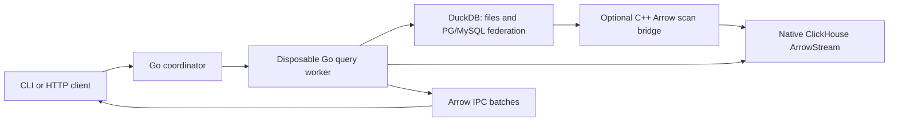

# Architecture

Kelvo Go owns source registration, query lifecycle, Arrow delivery and admission.
DuckDB supplies SQL execution and federation. Native ClickHouse executes at the source; an optional pinned C++ Arrow bridge connects its Go connector to DuckDB for selected-table federation.
No DataFusion, Drill, LLM/GPU runtime, Kubernetes operator or Hakopod dependency is included.

Each query uses a new process. Federated queries create a fresh DuckDB instance; native queries invoke their selected connector directly. Only selected source definitions and their explicitly named environment variables enter the worker. Cluster nodes launch that process through a native Landlock/seccomp sandbox before Go creates threads. Tenant containers provide PID, memory and network boundaries. Cancellation terminates the query process group; deployment supervision must also bound the process tree when a node is forcibly terminated. A process failure terminates its query; streams are not transparently resumed.

The callback contract is `Executor.Execute(context, Request, Sink)`. A sink borrows each Arrow batch only during its synchronous Write call. The DuckDB adapter keeps execution, record iteration and Release inside the leased `sql.Conn.Raw` callback.

The pinned DuckDB Go v2.10506.0 path uses non-streaming pending execution, then exposes batches. Kelvo bounds returned rows before execution and enforces delivery limits, but native allocations can precede a limit check. First-batch latency and working memory depend on the engine plan. For a native ClickHouse request, the same configured memory limit is passed to ClickHouse as its per-query memory budget and bounds Kelvo's local Arrow decoding allocator; it is still not a worker-process RSS cap.

Single-domain `serve` uses a bounded in-memory TTL registry and one service token. [Cluster mode](cluster.md) uses per-tenant tokens, NATS account isolation, atomic KV admission, worker leases and mTLS result delivery. It distributes independent queries among tenant-bound workers. External identity/KMS integration, an Arrow Flight SQL server (the project includes a Flight SQL client), durable query exports, CDC and additional native adapters remain future milestones.

[Dataset acceleration](acceleration.md) executes configured refresh queries in the same subprocess boundary and writes immutable Parquet generations. A private tenant store atomically publishes YAML manifests; queries pin only selected generations and receive no original-source credentials for dataset-only reads. Full refreshes can run manually, through a local scheduler, or through a bounded tenant NATS refresh queue. The default backend uses a tenant-specific POSIX volume. The opt-in object backend uses provider-conditional manifest publication and immutable Parquet objects. A parent-owned loopback range bridge serves only selected versions to DuckDB and rejects upstream redirects; cloud reader and writer credentials never enter snapshot query subprocesses. It does not pre-download whole snapshots or maintain a persistent local cache. This dataset lifecycle is separate from the per-query DuckDB instance and the query-handle TTL registry.

Live federation reads sources independently. It has no global transaction or comparable cross-source watermark. Later CDC must include snapshot/log handoff, durable checkpoints, idempotent replay, deletes, schema changes and recovery from expired source history.

Source references:

- [DuckDB Go Arrow API](https://github.com/duckdb/duckdb-go/blob/v2.10506.0/arrow.go)
- [Driver query execution](https://github.com/duckdb/duckdb-go/blob/v2.10506.0/statement.go#L778-L803)
- [DuckDB streaming flag](https://github.com/duckdb/duckdb/blob/v1.5.6/src/main/capi/pending-c.cpp#L17-L44)
- [Arrow IPC](https://arrow.apache.org/docs/format/Columnar.html#serialization-and-interprocess-communication-ipc)
- [Spice OSS](https://github.com/spiceai/spiceai), architectural reference

The [custom federation bridge](federation.md) receives DuckDB optimizer projections
and typed filters, executes supported predicates through Go native connectors,
and lends retained/pinned Arrow batches back through the C Data interface. The
first adapter is ClickHouse. It retains the existing subprocess trust boundary
and uses an opt-in pinned driver accessor patch; no Rust service is introduced.

Optional native federation builds compile a small C++17 Arrow scan shim against
DuckDB 1.5.6 headers and apply a scoped accessor patch to the same pinned Go
driver. The provisioning helper verifies both upstream inputs and leaves the
baseline go.mod unchanged. No Arrow C++ library or new runtime service is
introduced. See [build/upgrade constraints](federation.md#build-and-update) and
[retained MIT notices](../licenses/duckdb.txt).

For native federation builds, also update the version and archive/module checksums
in `scripts/provision_duckbridge.py`, review `scripts/duckbridge-driver.patch`,
and match the runtime check in `internal/duckbridge`. Build artifacts use a
separate module file with a local replacement. Regenerate it from the new pins;
do not reuse a patched module or C++ headers from an older engine. Run both the
ordinary and `duckbridge` test/build variants, strict cgo pointer checks with GC,
source-predicate conformance and the real ClickHouse acceptance script. A stable
Arrow C Data ABI does not make DuckDB's C++ planner interfaces version-independent.
